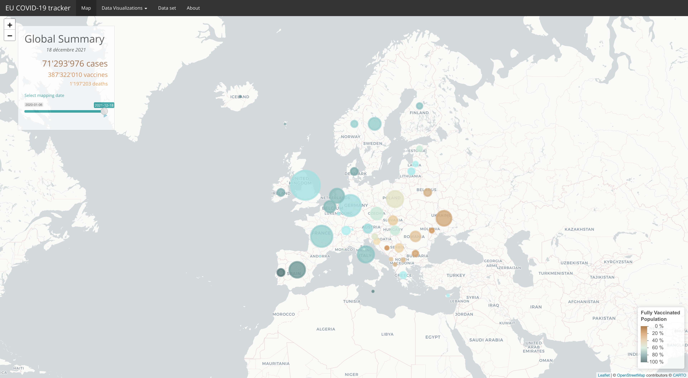

###  This is the library `projectG1` and it contains the function: **runDemo()**.

### This function automatically runs our shiny application where you can track covid19 in European countries. The first tab displays a map where you can find the vaccination rate, the covid19 case by country and the deaths. All these metrics can be moved backwards in time with a side bar.
{width=150%}

### The second tab provides you with two plots:
### 1. *Evolution of New Cases in Europe* is a general trend of new covid19 cases in each country. This plot is interactive and you can also go back in time.
### 2. *Covid-19 Total Cases by European Countries* is a static barplot that displays the total number of            cases form the beginning of the pandemic.
{width=150%}

### The tab `Comparator` allows you to select individually each country and compare their daily new cases in an interactive plot. In this example France and Germany are compared.
{width=150%}

{width=150%}

